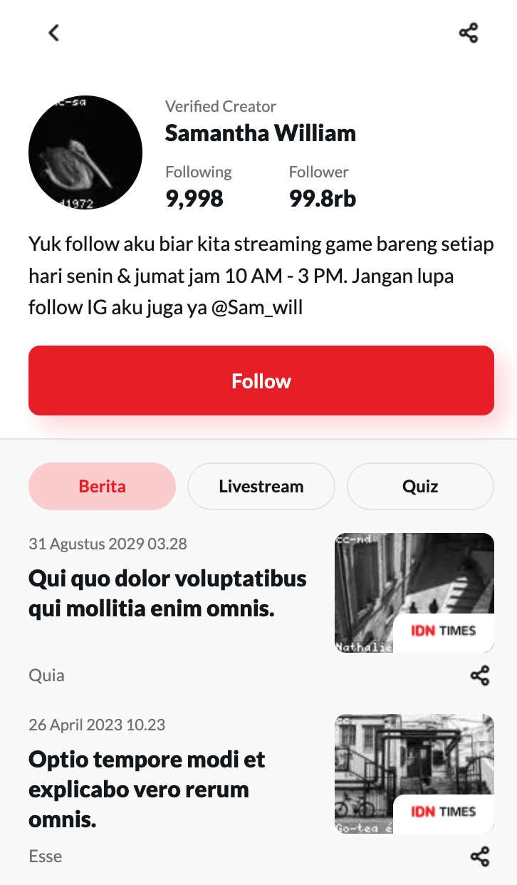
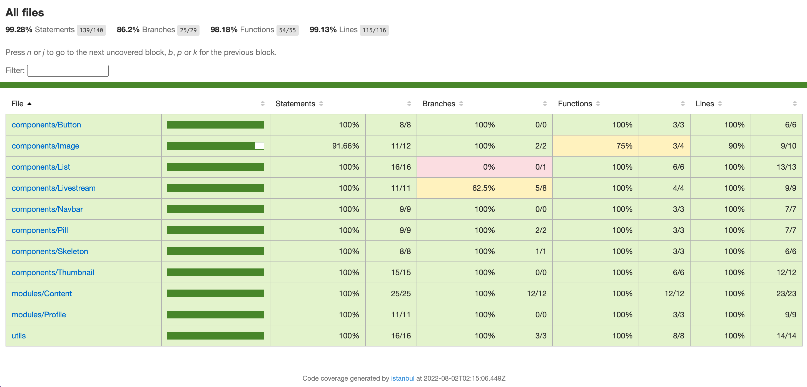
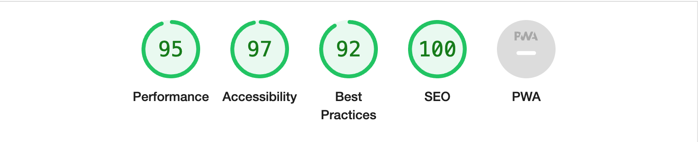

<!-- PROJECT LOGO -->
<br />
<div align="center">
  

  <h3 align="center">IDN Time Profile and News Page</h3>
  
  <p align="center">
    Website dengan profile and news feed
    <br />
    <a href="https://github.com/condrowiyono/news"><strong>Explore the docs »</strong></a>
    <br />
    <br />
    <a href="https://news-opal-omega.vercel.app/">View Demo on Vercel</a>
    ·
    <a href="https://github.com/condrowiyono/news/issues">Report Bug</a>
  </p>
</div>

## Struktur Folder

Menggunakan struktur folder bawaan dari typescript, dengan penambahan beberapa folder, seperti `components`, `modules`, dan `utils`. Untuk folder lengkap bisa dilihat di file [`tsconfig.json`](https://github.com/condrowiyono/news/blob/main/tsconfig.json). `components` berisi atomic component dan reusable, sementara `modules` adalah gabungan dari beberapa `components`, sedangkan `utils` berisi file-file utilitas, seperti `fotmatNumber, formatDate, etc`

## Instalasi di dev

Pertama jalanlan perintah yarn

```bash
npm run dev
# or
yarn dev
```

Buka [http://localhost:3000](http://localhost:3000) dan lihat hasilnya.

## Instalasi di prod

Pertama jalanlan perintah yarn

```bash
yarn build
yarn start
```

Buka [http://localhost:3000](http://localhost:3000) dan lihat hasilnya.

## Dokoumentasi Component

Terdapat atomic komponen baru, yaitu
- Button
- Image
- List
- Livestream
- Navbar
- Pill
- Skeleton
- Thumbnail


## Unit Testing
Unit testing dibagi menjadi 2, yaitu unit testing untuk fungsionalitas dan snapshot.
Berikut hasil unit testing.



## Lighthouse Report
Berikut pengecekan core web vital dengan lighthouse


